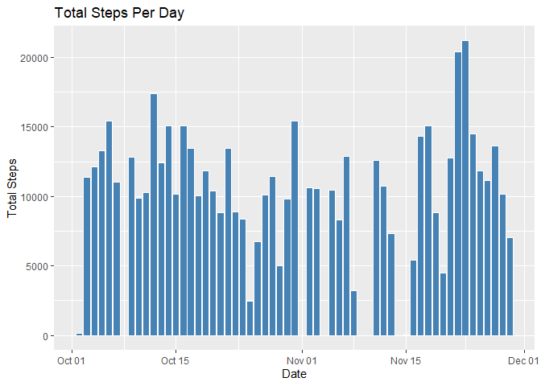
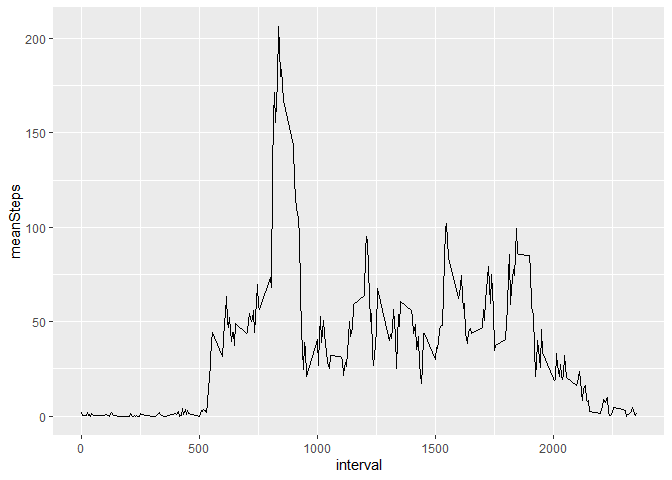
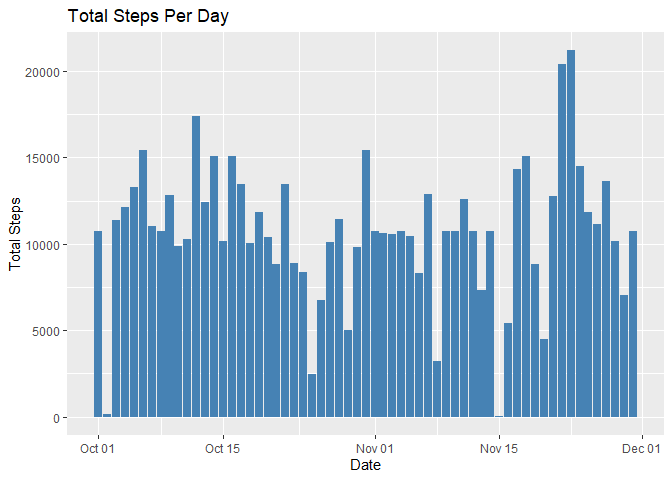
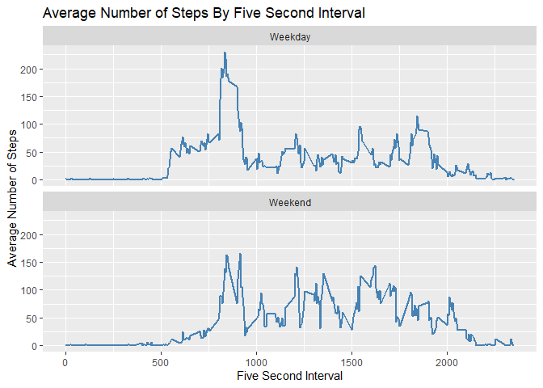

## Loading and preprocessing the data


```r
#packages
library(ggplot2)
library(dplyr)
```

```
## 
## Attaching package: 'dplyr'
```

```
## The following objects are masked from 'package:stats':
## 
##     filter, lag
```

```
## The following objects are masked from 'package:base':
## 
##     intersect, setdiff, setequal, union
```


```r
#load data

zip.url <- "https://github.com/coolhandluke999/RepData_PeerAssessment1/raw/master/activity.zip"

dir <- getwd()
zip.file <- "activity.zip"
zip.combine <- as.character(paste(dir, zip.file, sep = "/"))

download.file(zip.url, destfile = zip.combine)

unzip(zip.file)

data <- read.csv("activity.csv")

#clean data
#transform date from factor into date value

data$date <- as.Date(as.character(data$date))
```


## What is mean total number of steps taken per day?


```r
#calculate total number of steps per day

sumSteps <- data %>% group_by(date) %>% summarize(totalSteps = sum(steps))


ggplot(data = sumSteps, mapping = aes(x = date, y = totalSteps)) +
        geom_histogram(stat = "identity", color = "white", fill = "steelblue") +
        labs(title = "Total Steps Per Day", x = "Date", y = "Total Steps")
```



```r
#calculate and report the mean and median of the total number of steps taken per day

summary <- sumSteps %>% summarize(mean = mean(totalSteps, na.rm = TRUE),
                                  median = median(totalSteps, na.rm = TRUE))
```
The mean and median total number of steps per:

```r
library(xtable)
x <- xtable(summary)
print(x, type = "html")
```

<!-- html table generated in R 3.6.1 by xtable 1.8-4 package -->
<!-- Fri Dec 04 11:21:17 2020 -->
<table border=1>
<tr> <th>  </th> <th> mean </th> <th> median </th>  </tr>
  <tr> <td align="right"> 1 </td> <td align="right"> 10766.19 </td> <td align="right"> 10765 </td> </tr>
   </table>
                                  

## What is the average daily activity pattern?


```r
#average daily activity pattern

avgStepsInt <- data %>% group_by(interval) %>% summarize(meanSteps = mean(steps, na.rm = TRUE))

ggplot(data = avgStepsInt, mapping = aes(x = interval, y = meanSteps)) + 
        geom_line()
```



```r
#identify interval with highest steps

which.max(avgStepsInt$meanSteps)
```

```
## [1] 104
```

```r
avgStepsInt$interval[104]
```

```
## [1] 835
```
Interval 835 with 206 steps on average per day is the daily interval with the highest number of daily steps.

## Imputing missing values

Missing or NA values in the dataset are replaced here with imputed values. The imupted values
are the mean number of steps by interval. 

Where a missing step value exists it is replaced by the calculated mean number of steps for the interval that the missing value is associated with in the dataset. 

```r
#Total number of missing values in the dataset

sum(is.na(data))
```

```
## [1] 2304
```

```r
#add interval step means column to every record in dataset
data$stepsAvg <- avgStepsInt$meanSteps

#assign mean interval value to any row with steps = NA
data$steps[which(is.na(data$steps))] = data$stepsAvg[which(is.na(data$steps))]

sum(is.na(data))
```

```
## [1] 0
```

```r
which(is.na(data$steps))
```

```
## integer(0)
```

```r
#create new data set equal to data minus the added interval mean column
newData <- data[,1:3]

stepsMeanDay <- newData %>% group_by(date) %>% summarize(meanValue = mean(steps),
                                                         medianValue = median(steps))


ggplot(data = newData, mapping = aes(x = date, y = steps)) +
        geom_histogram(stat = "identity", fill = "steelblue") +
        labs(title = "Total Steps Per Day", x = "Date", y = "Total Steps")
```



```r
#steps increase dramatically when replacing NAs with interval means
```


## Are there differences in activity patterns between weekdays and weekends?


```r
#create factor variable for weekday and weekend types for each day

newData$dayOfWeek <- as.character(weekdays(newData$date))
weekday <- c("Monday", "Tuesday", "Wednesday", "Thursday", "Friday")

newData$dayType <- sapply(newData$dayOfWeek, FUN = function(x) ifelse((x %in% weekday), newData$dayType <- "Weekday", newData$dayType <- "Weekend"))

newData$dayType <- as.factor(newData$dayType)

stepsMeanDayType <- newData %>% group_by(dayType, interval) %>% summarize(meanValue = mean(steps))

ggplot(data = stepsMeanDayType, aes(x = interval, y = meanValue)) +
        geom_line(color = "steelblue", size = 1) +
        labs(title = "Average Number of Steps By Five Second Interval",
             y = "Average Number of Steps",
             x = "Five Second Interval") +
        facet_wrap(~ dayType, ncol = 1)
```


